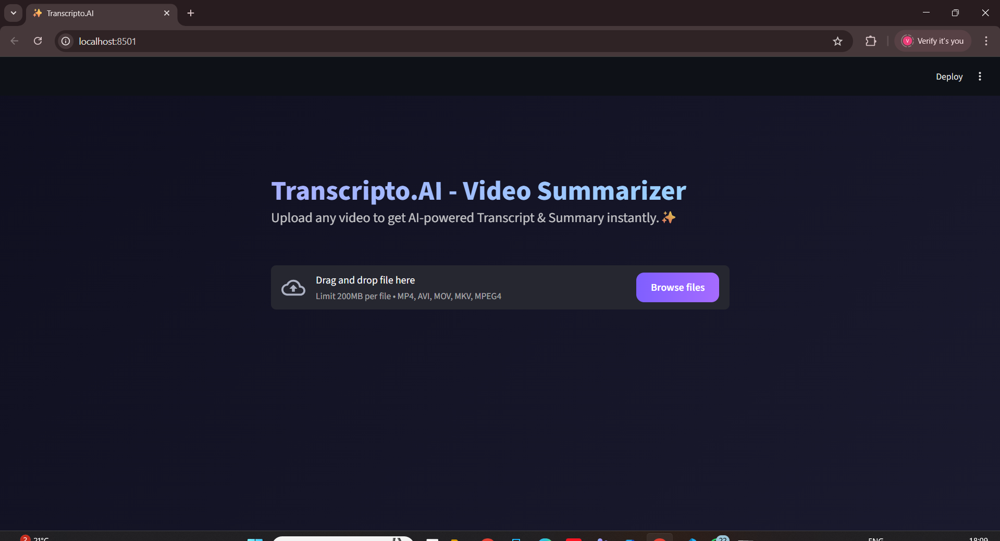
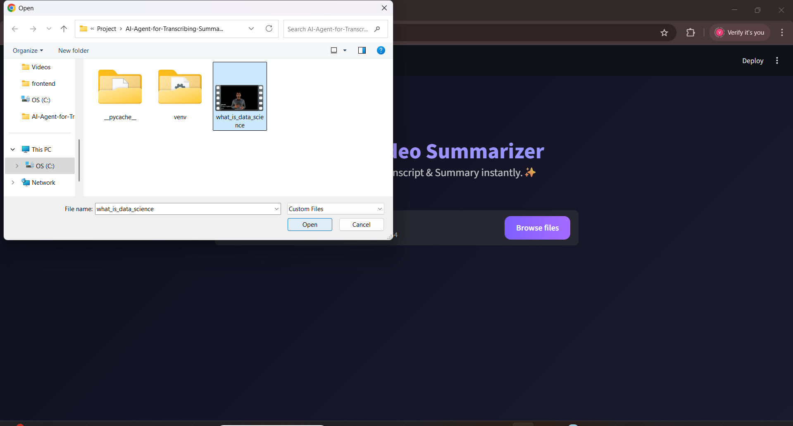
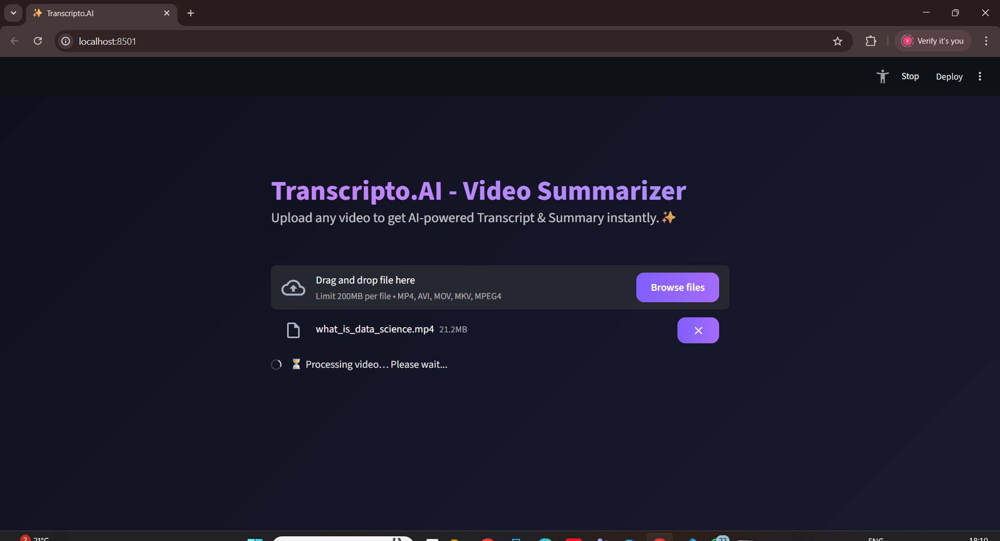
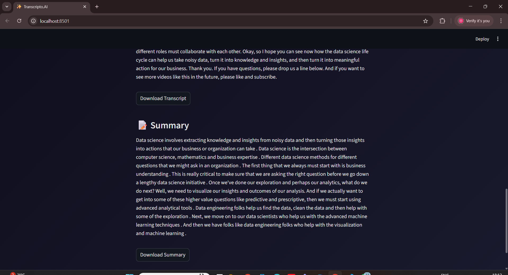
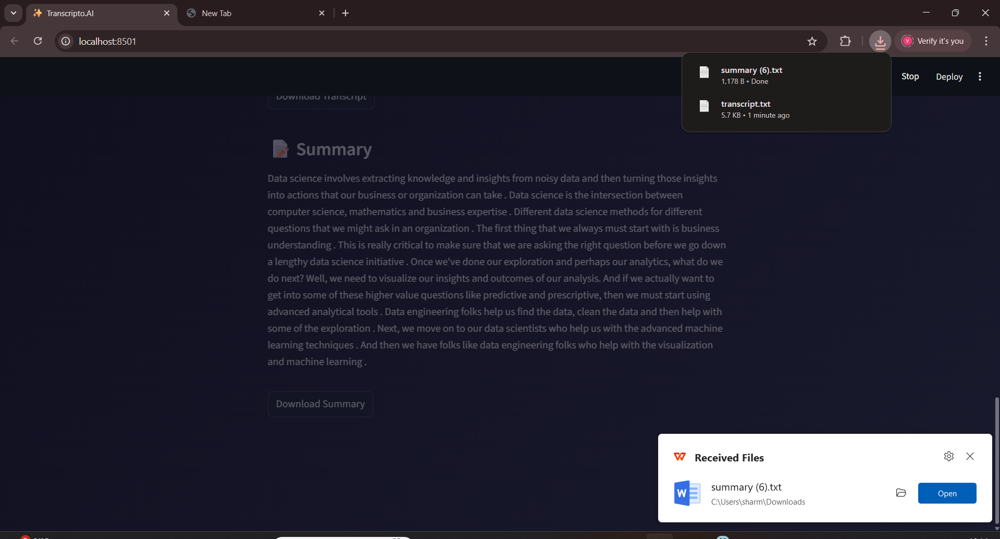

# 🎬 Transcripto.AI – Intelligent Video Transcription & Summarization

Transcripto.AI is an end-to-end AI-powered application that transforms long-form video content into **accurate transcripts** and **concise, human-like summaries**.
It leverages state-of-the-art models like **Whisper** for speech recognition and **BART** for natural language summarization, all integrated into an intuitive Streamlit interface.

---

## 🚀 Key Features

### 🎧 Video-to-Audio Processing

* Extracts high-quality audio using FFmpeg
* Supports multiple formats: MP4, MKV, MOV, AVI
* Optimized preprocessing for improved transcription accuracy

### 🗣 Speech-to-Text (Whisper)

* Powered by OpenAI Whisper
* Robust against noise, accents, and varied speech patterns
* Generates clean, punctuated transcripts

### ✂ Smart Text Chunking

* Automatically segments long transcripts
* Prevents token overflow in transformer models
* Maintains contextual continuity

### 🧠 AI Summarization (BART)

* Uses HuggingFace BART transformer
* Produces concise and meaningful summaries
* Retains key insights from long content

### 🌐 Interactive UI (Streamlit)

* Simple drag-and-drop video upload
* Real-time processing feedback
* Clean and responsive interface
* Download transcripts and summaries instantly

---

## 🔄 Processing Pipeline

```text
Video Input
   ↓
Audio Extraction (FFmpeg)
   ↓
Speech-to-Text (Whisper)
   ↓
Text Chunking
   ↓
Summarization (BART)
   ↓
Final Output (Transcript + Summary)
```

---

## 📁 Project Structure

```
AI-Agent-Transcribing-and-Summarizing-Videos/
│
├── app.py              # Streamlit UI
├── main.py             # Pipeline orchestration
├── transcriber.py      # Audio extraction + Whisper
├── summarizer.py       # BART summarization
├── utils.py            # Helper functions (chunking etc.)
├── requirements.txt    # Dependencies
└── notes.txt           # Additional notes
```

---

## ⚙️ Tech Stack

### 🤖 Machine Learning

* Whisper (Speech Recognition)
* BART Transformer (Summarization)
* PyTorch

### 🧩 Tools & Libraries

* Streamlit
* FFmpeg
* HuggingFace Transformers

### 💻 Language

* Python 3.10+

---

## 🛠 Installation & Setup

### 1️⃣ Clone the Repository

```bash
git clone https://github.com/your-username/AI-Agent-Transcribing-and-Summarizing-Videos.git
cd AI-Agent-Transcribing-and-Summarizing-Videos
```

### 2️⃣ Install Dependencies

```bash
pip install -r requirements.txt
```

### 3️⃣ Install FFmpeg

* Windows: Download from https://ffmpeg.org
* macOS:

```bash
brew install ffmpeg
```

* Linux:

```bash
sudo apt install ffmpeg
```

---

## ▶️ Run the Application

```bash
streamlit run app.py
```

Open your browser to interact with the app and upload videos for transcription and summarization.

---

## 📸 Screenshots

### 🔹 Home Page

<p align="center">
  
</p>

### 🔹 Upload Video

<p align="center">
  
</p>

### 🔹 Processing Screen

<p align="center">
  
</p>

### 🔹 Summary Output

<p align="center">
  
</p>

### 🔹 Transcript Output

<p align="center">
  
</p>

### 🔹 Download Transcript

<p align="center">
  
</p>

### 🔹 Download Summary

<p align="center">
  
</p>

---

## 🛣 Roadmap

* 🌍 Multi-language transcription
* 🔗 Support for multiple summarization models
* 📄 Export as PDF
* 🕒 Time-stamped transcripts
* ☁ Cloud deployment (AWS/GCP)
* 🎨 Enhanced UI/UX

---

---

## 👨‍💻 Author

**Vritika**
AI/ML Enthusiast | Building Real-World Intelligent Systems

🔗 GitHub: https://github.com/vritikavashisth
🔗 LinkedIn: https://linkedin.com/in/vritikasharmaa

---

## ⭐ Support

If you found this project useful, consider giving it a ⭐ on GitHub — it helps a lot!

