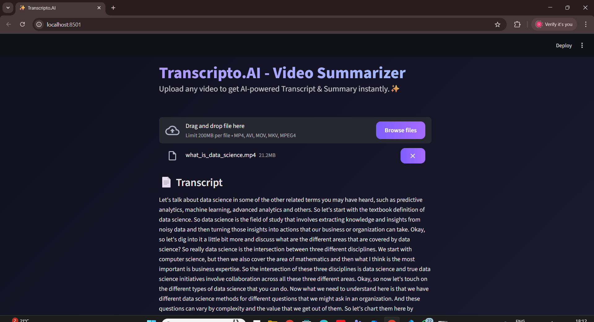
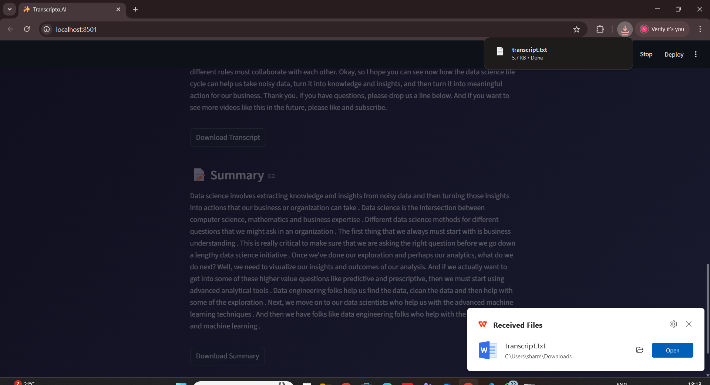

# 🎬 Transcripto.AI – Video Transcriptor & Summarizer

Transcripto.AI is a powerful and modern AI tool that converts long videos into **accurate transcripts** and **concise summaries**.  
It uses Whisper for speech-to-text and BART for text summarization — all wrapped in a clean Streamlit interface.

---

## 🚀 Features

### 1️⃣ 🎧 **Video-to-Audio Extraction**
- Uses FFmpeg to extract high-quality audio  
- Supports MP4, MKV, MOV, AVI  
- Clean audio → Better transcription accuracy  

### 2️⃣ 🗣 **Whisper Speech-to-Text**
- Powered by OpenAI Whisper  
- Handles background noise and multiple accents  
- Produces accurate, punctuation-ready transcripts  

### 3️⃣ ✂ **Intelligent Text Chunking**
- Automatically splits long transcripts  
- Prevents token overflow for summarization models  
- Maintains flow & context  

### 4️⃣ 🧠 **AI Text Summarization (BART)**
- Uses HuggingFace BART model  
- Converts long transcripts into short, meaningful summaries  
- Human-like natural language output  

### 5️⃣ 🌐 **Streamlit UI**
- Drag-and-drop video upload  
- Real-time progress indicators  
- Dark-mode friendly interface  
- One-click transcript and summary download  

---

## 🔄 Processing Pipeline

🎥 Video Input
↓
🎧 Audio Extraction (FFmpeg)
↓
🗣 Whisper Transcription
↓
✂ Smart Chunking
↓
🧠 BART Summarization
↓
📝 Final Output (Transcript + Summary)

---

## 📁 Project Structure

AI-Agent-Transcribing-and-Summarizing-Videos/
│
├── app.py # Streamlit GUI
├── main.py # Main pipeline
├── transcriber.py # Whisper + audio extractor
├── summarizer.py # BART summarizer
├── utils.py # Chunking + helpers
├── requirements.txt # Dependencies
└── notes.txt # Notes (optional)

---

## ⚙️ Technology Stack

### 🤖 **Machine Learning**
- Whisper (Speech-to-Text)  
- BART Transformer (Summarization)  
- PyTorch backend  

### 🧩 **Libraries & Tools**
- Streamlit  
- FFmpeg / ffmpeg-python  
- HuggingFace Transformers  

### 🖥 **Programming Language**
- Python 3.10+

---

## 🛠 Installation

### 1️⃣ Clone Repository
git clone https://github.com/your-username/AI-Agent-Transcribing-and-Summarizing-Videos.git
cd AI-Agent-Transcribing-and-Summarizing-Videos

2️⃣ Install Dependencies
pip install -r requirements.txt

3️⃣ Install FFmpeg
Windows: Download from ffmpeg.org
macOS:
brew install ffmpeg
Linux:
sudo apt install ffmpeg

▶️ Run the Application
streamlit run app.py
Your browser will open the interface where you can upload videos for transcription + summarization.

## 📸 Screenshots

### 🔹 Home Page

  

### 🔹 Upload Video

  

### 🔹 Processing Screen

  

### 🔹 Summary Output

  

### 🔹 Transcript Output

  

### 🔹 Download Transcript

  

### 🔹 Download Summary

  

🛣 Roadmap (Upcoming Features)
🌍 Multi-language transcription

🔗 Multi-model summarization

📄 Export transcript + summary as PDF

🕒 Time-stamped transcripts

☁ Cloud deployment

🎨 Improved UI animations

🤝 Contributing
Pull requests are welcome!
For major changes, please open an issue to discuss your proposal.

📄 License
This project is licensed under the MIT License.

❤️ Support
If you like this project, consider giving it a ⭐ on GitHub!
